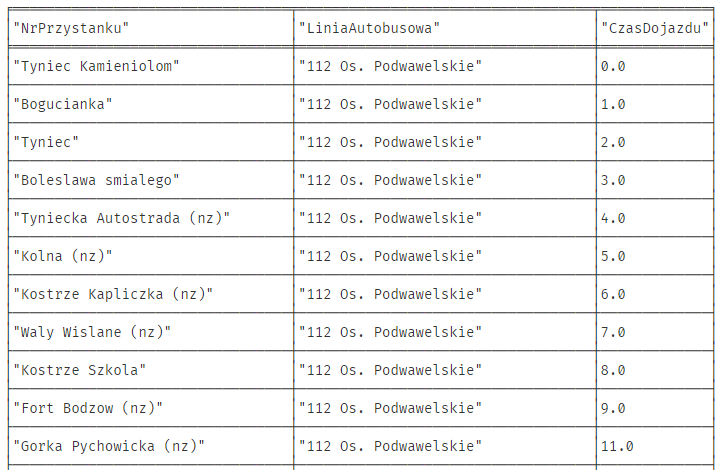
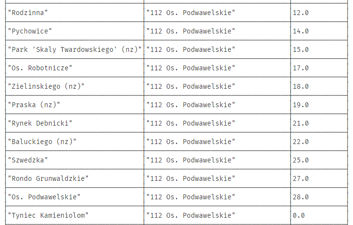
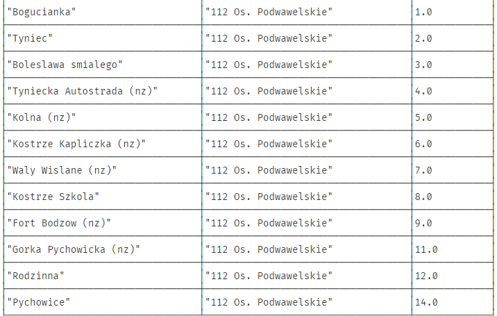
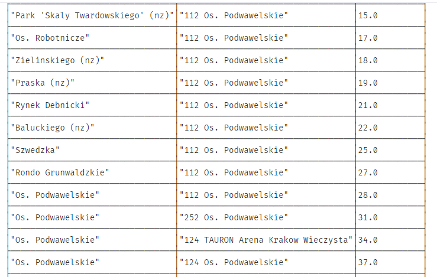
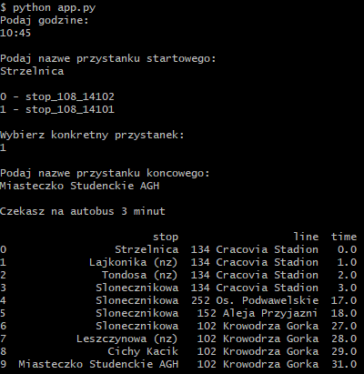

# JakDojade

Mini project for Database course at AGH UST - DataBases 2020  
Technologies used:
* Neo4j
* Python
* Cypher (query language)

## Setup bazy danych

1. Utworzenie nowej bazy Neo4J (jako hasło ustawić admin - można inne ale trzeba będzie później zmieniać w app.py)
2. Do bazy dodać plugin "Graph Data Science Library" (wymagane do funkcji shortestPath)
3. Odpalić skrypt real_script.py z folderu data_scripts
4. Przenieść 2 wygenerowane pliki (import_edges.txt i import_nodes.txt) do folderu bazy danych /installation-[version]/import
5. Po kolei odpalić 3 polecenia z import_ciphers.txt w Neo4JBrowser - wygeneruje to nam całe dane

## Neo4j - model danych i sposób ich przechowywania
Żeby w prosty sposób móc przechowywać informację o przystankach, a także móc w łatwy sposób znajdywać najkrótsze połączenia między przystankami postanowiliśmy skorzystać z poniższego modelu bazy:
```java
private Long id; //ID pojedynczego wierzchołka
private Integer arrival_hour; //godzina przyjazdu konkretnej linii na przystanek
private Integer arrival_minute; //minuta przyjazdu konkretnej linii na przystanek
private String stop_name; //nazwa przystanku
private String line_name; //nazwa linii
private String line_stop_id; //ID pozwalające na jednoznaczną identyfikację przystanku i linii 
                             //index założony na to pole, jest unique - służy do łatwego rozróżnienia node'ów
private String line_id; //ID linii
private String stop_id; //ID przystanku
```
Pojedynczy przystanek występuje zatem wiele razy - dla każdej linii i godziny dotarcia autobusu mamy zatem nowy node.  
Przystanki połączone są ze sobą relacją TIME, której wartość jest odległością w minutach jakiej potrzebujemy na przebycie drogi określoną linią. 
 
### Powyższy sposób zapisu ma swoje wady i zalety:  
**Wadą** jest redundancja danych - jak łatwo zauważyć zamiast 2997 unikatowych przystanków w bazie do Krakowa utworzonych jest ich 180 835, czyli 60 razy więcej  
**Zaletą**, która wynika z wady jest łatwość znajdywania najkrótszej drogi dla poszczególnych przystanków, ponieważ możemy zastosować istniejące funkcje dla neo4j w łatwy sposób do znalezienia najkrótszej drogi między 2 dowolnymi przystankami np.
* gds.alpha.shortestPath.stream()
* apoc.algo.dijkstra()

Upraszcza to znacznie problem znalezienia najkrótszej ścieżki 

## Neo4j - wygenerowanie bazy przystanków
Utworzenie bazy przystanków z Krakowa wymagało od nas uzyskania wszystkich połączeń i przystanków w Krakowie  
Uzyskaliśmy je z użyciem serwera ftp [ftp://ztp.krakow.pl](ftp://ztp.krakow.pl/)  
Uzyskaliśmy w ten sposób 4 pliki 
* routes.txt - id trasy, nazwa trasy
* stops.txt - id przystanków, nazwy przystanków
* stop_times.txt - id tripu, godzina odjazdu
* trips.txt - id tripu, id trasy, nazwa przystanku końcowego

Na podstawie uzyskanej w ten sposób listy przystanków i połączeń z użyciem skryptu *real_script.py* otrzymujemy 2 pliki 
* data/import_edges.txt
* data/import_nodes.txt

Na podstawie, których tworzymy pełną bazę danych przystanków dla Krakowa (przystanki musieliśmy pozbawić polskich znaków - w bazie neo4j były problemy z ich kodowaniem (�))

**Utworzenie wszystkich przystanków:**
```cypher
load csv with headers from "file:///import_nodes.txt" as csvline 
create(s: Stop {
line_stop_id: csvline.line_stop_id, 
stop_id: csvline.stop_id,
stop_name: csvline.stop_name,
line_id: csvline.line_id,
line_name: csvline.line_name, 
arrival_hour: toInteger(csvline.arrival_hour),
arrival_minute: toInteger(csvline.arrival_minute)
})
```
**Utworzenie indeksu na line_stop_id w celu przyspieszenia wyszukiwań:**
```cypher 
create index line_stop_id_index for (n: Stop) on (n.line_stop_id)
```
**Utworzenie wszystkich połączeń:**
```cypher 
load csv with headers from "file:///import_edges.txt" as csvline
match (prev: Stop {line_stop_id: csvline.prev_node}), (next: Stop {line_stop_id: csvline.next_node})
create (prev)-[:TIME {minutes: toInteger(csvline.minutes)}]->(next)
```

## Wygląd bazy w neo4j
**Dany przystanek w bazie:**  


**Dana linia w bazie:**  


**Jak możemy zauważyć - każdy przystanek sprowadza się do 2 akcji:**
* Poczekanie na następny autobus - ten sam przystanek - następna godzina
* Pozostanie w linii i podjechanie na następny przystanek


## Przykładowe query z wynikami
```cypher
MATCH (start:Stop {line_stop_id: "block_1_trip_11_service_1-stop_422_59101"}), 
(end:Stop {line_stop_id: "block_1_trip_11_service_1-stop_1201_281201"})
CALL gds.alpha.shortestPath.stream({
  nodeProjection: 'Stop',
  relationshipProjection: {
    TIME: {
      type: 'TIME',
      properties: 'minutes',
      orientation: 'NATURAL'
    }
  },
  startNode: start,
  endNode: end,
  relationshipWeightProperty: 'minutes'
})
YIELD nodeId, cost
RETURN gds.util.asNode(nodeId).stop_name AS stop, gds.util.asNode(nodeId).line_name AS line, cost as time
```
  


```cypher
CALL {
  MATCH(start:Stop {stop_name: "Tyniec Kamieniolom"})
  WHERE start.arrival_hour > 10 OR (start.arrival_minute >= 45 AND start.arrival_hour = 10)
  RETURN start
  ORDER BY start.arrival_hour, start.arrival_minute
  LIMIT 1
}
  MATCH(end:Stop {stop_name: "Os. Podwawelskie"})
  WHERE end.arrival_hour > start.arrival_hour OR (end.arrival_minute > start.arrival_minute AND end.arrival_hour = start.arrival_minute)
CALL gds.alpha.shortestPath.stream({
  nodeProjection: 'Stop',
  relationshipProjection: {
    TIME: {
      type: 'TIME',
      properties: 'minutes',
      orientation: 'NATURAL'
    }
  },
  startNode: start,
  endNode: end,
  relationshipWeightProperty: 'minutes'
})
YIELD nodeId, cost
RETURN gds.util.asNode(nodeId).stop_name AS NrPrzystanku, gds.util.asNode(nodeId).line_name AS LiniaAutobusowa, cost as CzasDojazdu
LIMIT 50
```
  
  
  
  
    
Jak widzimy, za pomocą shortestPath nie możemy zwrócić pojedynczej drogi, ponieważ dajemy wiele wierzchołków wyjściowych, ale ustawiając LIMIT możemy zmniejszyć liczbę znalezionych dróg, zachowując przy tym zawsze tą najszybszą, a następnie wynik parsować z użyciem np. pythona

## Skrypt pythonowy korzystający z bazy do wyszukiwania połączenia
Na podstawie powyższych queries stworzyliśmy skrypt pythonowy korzystający z bazy danych, który na podstawie wskazanych
* przystanka początkowego
* przystanka końcowego
* aktualnej godziny i minuty

wskaże nam najszybszą drogę do przystanka końcowego

**Łączenie z bazą danych**
```python
uri = "bolt://localhost:7687"
driver = GraphDatabase.driver(uri, auth=("neo4j", "admin"), encrypted=False)
session = driver.session() 
```

**Pobieranie od użytkownika informacji odnośnie przystanku startowego, docelowego, godziny**
```python
time = input("Podaj godzine")
time_hour, time_minute = parse_time(time)

start_stop_name = input("Podaj nazwe przystanku startowego: \n")

available_start_stops = session.run(f"""match 
    (s: Stop {{stop_name: '{start_stop_name}'}})
    return distinct s.stop_id""").data()

for i, start_stop in enumerate(available_start_stops):
    print(f'{i} - {start_stop["s.stop_id"]}')

start_stop_idx = int(input("Wybierz konkretny przystanek: \n"))

start_stop_id = available_start_stops[start_stop_idx]['s.stop_id']

end_stop_name = input("Podaj nazwe przystanku koncowego: \n")

start_node_data = session.run(f"""
    match (start: Stop {{ stop_id: "{start_stop_id}" }}) 
    where start.arrival_hour > {time_hour} or (start.arrival_hour = {time_hour} and start.arrival_minute >= {time_minute}) 
    return start.line_stop_id
    order by start.arrival_hour, start.arrival_minute 
    limit 1""").data()
    
start_line_stop_id = start_node_data[0]['start.line_stop_id']
```

**Korzystanie z query cyphera**
```python
shortest_path_cipher = ( 
    f"""
    MATCH (start:Stop {{line_stop_id: "{start_line_stop_id}"}}) 
    CALL {{
        MATCH
        (end:Stop {{stop_name: "{end_stop_name}"}})
        WHERE end.arrival_hour > 10 or (end.arrival_hour = 10 and end.arrival_minute >= 45) 
        RETURN end 
        ORDER BY end.arrival_hour, end.arrival_minute 
    }}
    
    CALL gds.alpha.shortestPath.stream({{
    nodeProjection: 'Stop',
    relationshipProjection: {{
        TIME: {{
        type: 'TIME',
        properties: 'minutes',
        orientation: 'NATURAL'
        }}
    }},
    startNode: start,
    endNode: end,
    relationshipWeightProperty: 'minutes'
    }})

    YIELD nodeId, cost
    RETURN gds.util.asNode(nodeId).stop_name AS stop, gds.util.asNode(nodeId).line_name AS line, cost as time
    LIMIT 100
    """
)
```

**Wyliczanie najkrótszej drogi i podanie outputu**
```python
shortest_paths_data =  session.run(shortest_path_cipher).data()
shortest_path_raw = get_shortest_path_raw(shortest_paths_data)
DataFrame(shortest_path_raw)
driver.close()
```

## Przykładowe użycie skryptu pythonowego\
    

## Written by:
- [@what-ewer](https://github.com/what-ewer)
- [@hardkov](https://github.com/hardkov)

